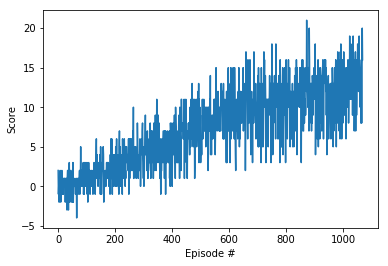

##Report
#####Learning Algorithm
I have implemented Doble DQN network, based on Lunar Lander Agent from the project.

Hyperparameters:
BUFFER_SIZE = int(1e5) 
BATCH_SIZE = 64         
GAMMA = 0.99           
TAU = 1e-3             
LR = 5e-4               
UPDATE_EVERY = 4    
EPSILON = 1
EPSILON_MIN = 0.01
EPSILON_DECAY = 0.998
NETWORK = 2 x Linear each with 128 units

Environment was solved after 969 episodes

#####Future development
* I will implement Prioritized replay and double DQN. Unfortunately i lost code for PER during the development,
my Udacity environment somehow refreshed and it got overwritten, when I was trying to have separate notebook for each "level"  
of upgrade. Next time I will probably implement locally.
* I will eventually play with rainbow, mainly to improve my knowledge of Pytorch and to complete my DQN ToolBox
* I will try to use techniques learned here for my diploma thesis on university 
* I will probably try to use techniques from here in my job

